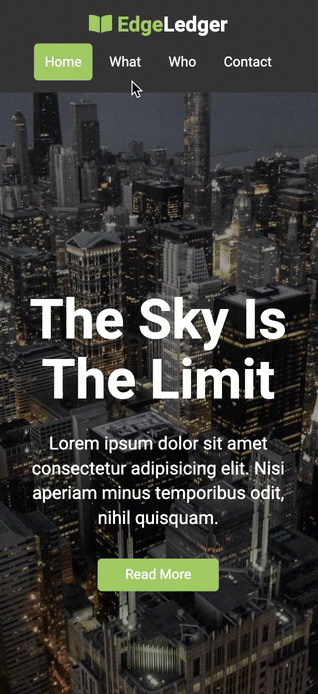

# EdgeLedger - Fully Responsive Static Site, with Flexbox!

[Demo Site](https://xboudsady.github.io/edge-ledger-website/#home)

Static site, with fully response design feature using the CSS Flexbox technology! Two additional css for media queries on wide screen, and mobile devices.

Semantic HTML 
* Navigation Bar - Sticky navba
* Header - Showcase
* Section - What We Do
* Section - Who We Are
* Section - Clients
* Section - Contact
* Built in Utilities classes

## Technology Used
* [Google Maps](https://developers.google.com/maps/documentation) - Build customized, agile experiences that bring the real world to your users with static and dynamic maps, Street View imagery, and 360° views.
* [Google Fonts](https://fonts.google.com/) - Google Fonts is a library of 980 free licensed font families, an interactive web directory for browsing the library, and APIs for conveniently using the fonts via CSS and Android.
* [jQuery](https://jquery.com/) - jQuery is a fast, small, and feature-rich JavaScript library.
* [Font Awesome](https://fontawesome.com/) - The world's most popular and easiest to use icon set just got an upgrade. More icons. More styles.

## Page Setup

### Navigation Bar
* Logo on left, with four Navigation with relative link to site section.
* Sticky Navigation to top of page.
* Smooth Scrolling when hyperlinking to page section.
* Opacity when scrolling down.

### Header
* Background Image
* Overlay applied to backround image

### Section: What We Do
* Font Awesome Icons
* Re-arrange to block level when smaller screen

### Section: Who We Are
* Two section, using Flex to handler division.

### Section: Our Clients
* Custom logo .png in file

### Section: Contact Us
* Contact Form
* Google Map, via Google Maps Platform
  * Note: API is restricted to current deployed site only. If cloning project, please generate your own API key on function call.

## Wide Screen View

## Mobile Screen View

